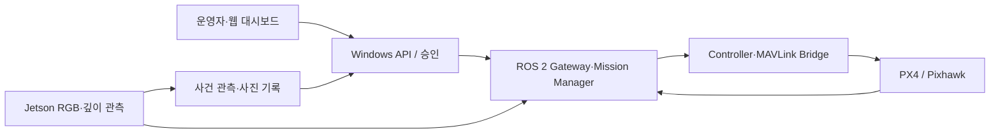

# LLM과 Jetson을 이용한 교내 순찰 UAV 시스템

VECTORFORCE는 음성·텍스트 명령과 영상 분석을 결합한 교내 순찰 드론 시스템입니다. 운영자가 웹 대시보드에서 순찰을 요청하면 LLM이 명령을 임무 계획으로 정리하고, 운영자의 검토와 승인을 거쳐 비행 제어에 전달합니다.
Jetson의 카메라와 깊이 센서로 장애물과 화재·연기 등 이상 상황을 관측하고, 사건 기록과 복귀 절차로 연결하도록 설계했습니다. 대시보드에서는 기체 상태와 임무 진행 상황을 확인할 수 있으며, 주요 상태는 음성으로도 안내합니다.

## 1. 프로젝트 배경

### 1.1. 국내외 시장 현황 및 문제점

드론 순찰에서는 조종자가 기체 조작과 영상 감시를 동시에 맡을 수 있어 인지 부담이 큽니다. 여러 구역을 반복하며 사람·차량·화재 같은 대상을 확인할 때는 관측 결과를 임무 및 비행 상태와 연결할 필요가 있습니다. 팀 보고서는 자연어 기반 UAV 제어와 RGB-D 장애물 회피의 관련 연구를 검토합니다. 시장 규모에 관한 수치는 조사하지 않았으므로 제시하지 않습니다.

### 1.2. 필요성과 기대효과

본 프로젝트는 음성·텍스트 명령을 구조화된 순찰 임무로 변환하고, 운영자가 승인한 경로의 위험 대상과 사건을 관측·기록하는 것을 목표로 합니다. 기대효과는 반복 순찰의 조작 부담을 줄이고 사건 근거를 재검토할 수 있게 하는 것입니다. 실제 운영 효과는 추가 현장 평가가 필요합니다.

## 2. 개발 목표

### 2.1. 목표 및 세부 내용

- 대시보드에서 음성·텍스트 명령을 임무로 구성하고, 경로와 정책을 검증·승인합니다.
- Jetson의 RGB·깊이 입력으로 사람·차량·화재·연기, 이상행동 및 장애물을 관측합니다.
- ROS 2 제어 경로에서 승인, 상태 신선도, 조종기 개입, 착륙 조건을 확인합니다.
- 확정된 사건의 사진·기록을 남기고 경로 복귀 및 종료 동작을 연결합니다.

### 2.2. 기존 서비스 대비 차별성

자연어 명령을 바로 비행 명령으로 사용하지 않고, 구조화된 계획의 스키마·정책을 검증한 뒤 운영자의 승인을 받습니다. 경로 승인, 관측 근거, 조종자 개입과 사건 기록을 같은 임무 흐름으로 묶었습니다. 팀 보고서는 관련 연구와 접근 방식을 비교하며, 상용 서비스 대비 우위를 입증한 평가는 제시하지 않습니다.

### 2.3. 사회적 가치 도입 계획

교내 순찰 중 화재·연기와 이상행동 같은 상황의 확인과 기록을 돕는 용도를 상정합니다. 사람이나 행동에 대한 자동 판정은 현장 확인을 대체하지 않으며, 촬영 자료의 공개 범위와 보관은 실제 운영 절차에 따라 정해야 합니다.

## 3. 시스템 설계

### 3.1. 시스템 구성도



그림은 목표 구성과 코드 경계를 나타냅니다. 최신 후보의 전체 경로가 실기체에서 검증됐다는 뜻은 아닙니다. 실제 하드웨어 연결과 비행 시험은 별도 절차가 필요합니다.

### 3.2. 사용 기술

| 영역 | 기술 |
| --- | --- |
| 화면 | React, TypeScript, Vite, Leaflet |
| API·서비스 | Python, FastAPI, WebSocket |
| 기체 연동 | ROS 2 Humble, PX4, MAVLink, Pixhawk |
| 관측 | Jetson Orin Nano, Intel RealSense D435, YOLO11n, MobileNetV3-Small·GRU |

추론 모델 가중치와 장비별 개인 설정은 이 저장소에 포함하지 않습니다.

## 4. 개발 결과

### 4.1. 전체 시스템 흐름도

운영자 준비·승인 → 상태 및 입력 신선도 확인 → 경로·관측 처리 → 장애물 또는 사건 대응 → 기록 및 종료 결과 확인 순서로 설계했습니다. 실행 중 실제 명령 전송은 별도 출력 게이트와 장비 상태에 좌우됩니다.

### 4.2. 기능 설명 및 주요 기능 명세서

| 기능 | 입력 | 출력·현재 확인 범위 |
| --- | --- | --- |
| 경로 준비·승인 | 운영자 입력, 현재 기체 상태 | 임무 계획과 승인 상태. 과거 대시보드 경로 비행은 사용자 확인 결과로 기록됨 |
| 장애물 관측·회피 | RGB·깊이, 위치·자세, 신선도 | 거리 판단과 제어 후보. 최신 통합 후보의 전체 실비행 회피 완료는 미검증 |
| 사건 관측·사진 | 카메라 영상, 추론 결과 | 확정 사건과 사진 기록. 지상 시연 성능 수용과 비행 중 전체 절차 검증은 구분 |
| 복귀·착륙 | 임무 상태, PX4 상태, 승인·제어권 | 제어 로직과 회귀 시험. 최신 후보의 전체 실비행 시나리오는 미검증 |

팀 보고서의 개발 평가에서는 한국어 명령 40건 모두 JSON 파싱·스키마 검사를 통과했고, 정상 명령 12건의 핵심 필드 96개가 기대값과 일치했습니다. 화재·연기 모델은 평가셋 mAP50 71.55%, 이상행동 v2는 검증셋 Accuracy 64.85%와 Macro-F1 44.10%를 기록했습니다. 이 수치는 해당 평가 자료의 결과이며 실제 순찰 영상의 성능을 보장하지 않습니다. PC/WSL·Gazebo·PX4 SITL에서는 사건 확정 뒤 정지·5초 촬영·귀환·착륙 완료 사례 3건이 보고되었습니다. 실기체에서는 경로 비행과 조종기 개입을 확인했으나 전체 통합 시나리오는 남아 있습니다.

최신 `runtimeio1` 후보의 로컬 기록은 ROS 747개, 핵심 Python 156개, native·observe 38개, frontend 70개 시험 통과입니다. 시험군에는 중복이 있을 수 있으며 합산해 독립 시험 수로 해석하지 않습니다. [후보 설명](software/runtimeio1/README_RUNTIMEIO1.md)과 [릴리스 목록](software/runtimeio1/ROUTE_RELEASE_MANIFEST.json)을 참고하세요.

### 4.3. 디렉토리 구조

- `software/runtimeio1/`: 최신 통합 후보 소스, 설정, 빌드·검증 스크립트, 기술 문서
- `software/runtimeio1/frontend/`: 운영 대시보드
- `software/runtimeio1/ros2_ws/`: ROS 2 패키지
- `software/runtimeio1/src/` 및 `windows_dashboard_api/`: Python 서비스와 Windows API 소스
- `docs/`: 팀의 보고서·포스터·발표자료

이전 후보와 로컬 검증 로그는 공개본에서 제외했습니다. 공개본의 해시 목록은 제외한 파일에 맞춰 갱신했으며, 실행 코드의 원본 해시는 유지했습니다.

### 4.4. 산업체 멘토링 의견 및 반영 사항

산업체 자문에서 제안한 내용 중 현재 공개한 코드에서 확인되는 반영 사항은 다음과 같습니다.

| 자문 의견 | 확인된 반영 사항 |
| --- | --- |
| 단계별 응답 시간 측정 | 계획 API가 LLM 처리, 경로 해석, 전체 계획 시간을 각각 밀리초 단위로 기록하고 운영 상태 요약에 최근값과 평균값을 제공합니다. |
| 명령 분류와 안전한 승인 절차 | 계획 결과를 `OK`, `NEED_CLARIFICATION`, `UNSUPPORTED`로 구분합니다. `OK` 계획만 운영자에게 승인 대상으로 제시하며, 비행 실행에는 별도 승인이 필요합니다. |
| 음성 피드백 | 로컬 TTS로 계획 승인 요청, 계획 실패, 임무 시작·종료, 제어권 전환 등 주요 상태를 안내합니다. |

## 5. 설치 및 실행 방법

### 5.1. 설치절차 및 실행 방법

**소스 확인만 할 때** Python 3.10 이상에서 다음을 실행합니다. 이 검사는 장비를 연결하거나 비행 명령을 보내지 않습니다.

```bash
python software/runtimeio1/scripts/verify_route_release.py software/runtimeio1
```

**대시보드 빌드와 시험**에는 Node.js와 npm이 필요합니다.

```bash
cd software/runtimeio1/frontend
npm ci
npm test
npm run build
```

**통합 실행**에는 Ubuntu/Jetson의 ROS 2 Humble, `px4_msgs`, 기존 ROS underlay, 카메라·추론 모델 환경, Pixhawk 연결 및 장비별 설정이 별도로 필요합니다. [빌드·시험 스크립트](software/runtimeio1/scripts/build_test_scenario.sh)는 기존 underlay 경로를 전제로 합니다. [실행 스크립트](software/runtimeio1/scripts/run_scenario.sh)는 관측 서비스를 중지하고 USB 소유권을 확인하므로, 장비 담당자가 [USB 경로 절차](software/runtimeio1/docs/MAVLINK_USB_ROUTE_KO.md)를 검토한 뒤 사용해야 합니다. 저장소를 복제한 것만으로 실기체 실행 준비가 끝나지는 않습니다.

네트워크 주소와 장치 이름은 코드의 현장 예시 설정입니다. 실제 환경에 맞게 검토해야 하며, 키·토큰·모델 가중치는 별도 관리합니다.

### 5.2. 오류 발생 시 해결 방법

- `RELEASE_OK`가 나오지 않으면 복사 중 파일이 빠졌거나 변경됐는지 해시 목록을 확인합니다.
- ROS build에서 패키지를 찾지 못하면 Humble, `px4_msgs`, 기존 underlay 설치·source 상태를 확인합니다.
- USB 소유자가 남아 있으면 관측 서비스의 정상 종료 절차를 확인합니다. 다른 프로세스를 강제 종료해 우회하지 않습니다.
- 관측 입력이 만료되거나 위치 추정이 유효하지 않으면 비행 가능 판정으로 취급하지 않습니다.

## 6. 소개 자료 및 시연 영상

### 6.1. 프로젝트 소개 자료

- [팀 최종보고서 DOCX](docs/01.보고서/최종보고서.docx)
- [프로젝트 포스터 PDF](docs/02.포스터/포스터.pdf)
- [프로젝트 소개 발표자료 PPTX](docs/03.발표자료/프로젝트소개.pptx)

### 6.2. 시연 영상

- [졸업과제 소개 동영상 — 부산대학교 정보컴퓨터공학부 YouTube 채널](https://youtu.be/e1Y19TbHnKA?si=wTHPoN0OIrua0t9u)

발표자료에도 시뮬레이션 영상이 포함되어 있습니다. 소개 영상과 시뮬레이션 자료는 최신 통합 후보의 전체 실기체 비행 성공을 입증하는 자료로 해석하지 않습니다.

## 7. 팀 구성

### 7.1. 팀원별 소개 및 역할 분담

| 팀원 | 역할 |
| --- | --- |
| 이태경 | YOLO 기반 위험 탐지 모델 학습, 실기체 현장 비행·반복 시험, 비행 안정화 작업 및 시험 결과에 따른 코드 수정, 보고서 작성 |
| 윤태영 | LLM 기반 임무 생성·정책 처리, 대시보드·백엔드 API 및 데이터 연동, ROS 2/PX4 기반 비행 제어 연동과 시스템 통합 |


## 8. 참고 문헌 및 출처

- [학과 캡스톤 저장소 템플릿](https://github.com/pnucse-capstone2026/Capstone-Template-2026)
- [ROS 2 Humble 문서](https://docs.ros.org/en/humble/)
- [PX4 문서](https://docs.px4.io/main/en/)
- 연구·모델·데이터셋 출처의 전체 목록은 [팀 최종보고서 6장](docs/01.보고서/최종보고서.docx)을 참고하세요.
